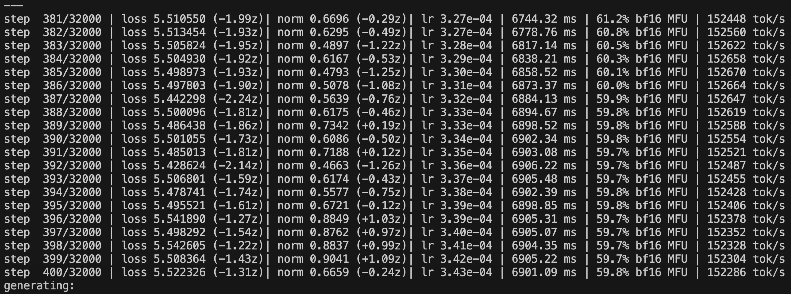

some key takeaways from Andrej's video.

# Pre-training

## step1: download and preprocess the internet

[fineWeb](https://huggingface.co/spaces/HuggingFaceFW/blogpost-fineweb-v1): a new, large-scale (15-trillion tokens, 44TB disk space) dataset for LLM pre-training.

How to find the raw data: use a public repository of crawled webpages. like the one maintained by the non-profit CommonCrawl

## step2: tokenization

Convert between raw text into sequences ot symbols/tokens 

example: ~5000 Unicode characters
- ~= 40.000 bits (2 possible tokens)
- ~= 5000 bytes (256 possible tokens)
- ~= 1300 GPT-4 tokens (100.277 possible tokens)

一个在线可交互的tokenizer：[Tiktokenizer](https://tiktokenizer.vercel.app)

## step3: neural network training

[LLM可视化](https://bbycroft.net/llm)

给定输入和输出（label），对模型的参数进行训练/拟合，训练完成之后，会得到一组满意的权重（weights），然后便可以进入下一阶段：推理。

## step4: inference

根据用户给定的输入，模型会利用训练得到的权重计算出相应的输出，返回给用户。

## demo: reproducing OpenAI‘s GPT-2

GPT-2 was published by OpenAl in 2019, in Paper: [Language Models are Unsupervised Multitask Learners](https://cdn.openai.com/better-language-models/language_models_are_unsupervised_multitask_learners.pdf)

GPT-2 is a transformer neural network with:
- 1.6 billion parameters
- maximum **context length** of 1024 tokens
- trained on about 100 billion tokens

My reproduction: [llm.c](https://github.com/karpathy/llm.c/discussions/677), training cost is about 1day/$672.

Why training cost drops so quickly?
1. dataset has gotten much better
2. computers have gotten much faster
3. software has gotten much efficient

截图中的每一行代表一次模型的参数更新，每一次更新会从dataset中提取**1m token**作为输入，时长大约为7s，总共需完成32000次更新。可以看出，随着参数更新的进行，模型的损失在逐渐降低。完成20次更新后，模型会进行一次推理，用于检验模型的生成效果。

训练硬件分析：
- 训练平台：[lambda](https://lambdalabs.com)
- 训练硬件：8xH100 node

## base model release

大的科技公司会定期公开他们训练好的基础模型，如下表所示：

| 名称        | 公司   | 发布日期 |
| ----------- | ------ | -------- |
| GPT-2 1.6B  | openAI | 2019     |
| llama3 405B | meta   | 2024     |

以[openAI GPT-2](https://github.com/openai/gpt-2)为例，公开的内容通常包括
1. model.py：用于描述模型结构的python代码
2. 模型权重

基础模型一般不带有问答功能，只会根据输入预测接下来的token是什么，相当于一个网络文本模拟器（internet document simulator）。由于其内在的概率模型输出机制，即使输入相同的提示词，每次得到的回复都是不一样的。

带有Instruct后缀的基础模型可以直接作为问答助手来使用。

使用[Hyperbolic](https://hyperbolic.xyz)对基础模型进行简单测试。

# Post-training

Post-training的目的是在base model的基础上得到一个有实用价值的assistant，使用conversation example（问答实例）而不是代码进行“编程”。

如何使用conversation数据对模型进行微调（supervised fine-tuning, SFT）？
类比TCP/IP中的数据包（包含表头和数据）的概念，按照一定的规则对conversation进行编码，然后再将进行tokenization，如下所示：

原始对话为：

> what is 2+2? 
> 
> 2+2=4
> 
> what if It was *?
> 
> 2*2=4, same as 2+2!

进行编码后的对话为：

> <|im_start|>user<|im_sep|>what is 2+2? <|im_end|>
> 
> <|im_start|>assistant<|im_sep|>2+2=4<|im_end|>
> 
> <|im_start|>user<|im_sep|>what if It was *?<|im_end|>
> 
> <|im_start|>assistant<|im_sep|>2*2=4, same as 2+2!<|im_end|>
> 
> <|im_start|>assistant<|im_sep|>

tokenization之后为：

> 200264, 1428, 200266, 13347, 382, 220, 17, 10, 17, 30, 220, 200265, 200264, 173781, 200266, 17, 10, 17, 28, 19, 200265, 200264, 1428, 200266, 13347, 538, 1225, 673, 425, 30, 200265, 200264, 173781, 200266, 17, 9, 17, 28, 19, 11, 2684, 472, 220, 17, 10, 17, 0, 200265, 200264, 173781, 200266

2022年openAI发布了关于模型微调的经典论文：[Training language models to follow instructions with human feedback](https://arxiv.org/pdf/2203.02155)。openAI并没有公布其用于模型微调的对话数据集，但是在网上可以找到一些开源的对话数据集，比如[OpenAssistant](https://huggingface.co/datasets/OpenAssistant/oasst2)。

在最近的研究中，我们不再依赖人工生成的对话数据集，而是利用已有的LLM来自动生成这些对话数据集，用于新模型的微调，例如[UltraChat](https://github.com/thunlp/UltraChat)。

key takeaway

> when you are talking with ChatGPT, you don't get those simultaneous answers from a magic AI, but from a group of highly educated experts hired by openAI. 
>
> ChatGPT is a statistical simulation of a human labeler

## Hallucinations

在[huggingface/inference-playground](https://huggingface.co/spaces/huggingface/inference-playground)中，如果使用一些较老的模型，比如[falcon-7b-instruct](https://huggingface.co/spaces/huggingface/inference-playground?modelId=tiiuae/falcon-7b-instruct)，当被问及一些杜撰的问题时，我们会发现模型在编造一些回答（Hallucination），例如：

> who is Orson Kovacs?
>
> Orson Kovacs is a fictional character in the 1956 science fiction novel "The Space Merchants" by Frederic Brown. The character is a space trader who deals with interplanetary commerce and politics.

## mitigation 1

在meta 2024年发表的一项研究中[The Llama 3 Herd of Models](https://arxiv.org/pdf/2407.21783)，他们在训练数据集里添加了一些模型不知道的问题，并告诉模型这些问题的正确的答案是不知道。通过这一训练（model interrogation），模型学会了如何判断自己的知识边界，并能够正确回答自己不知道的问题（knowledge-based refusal），而不是编撰一些虚构的答案（Hallucination），例如：

> who is Orson Kovacs?
>
> I'm sorry, I don't believe I know.

