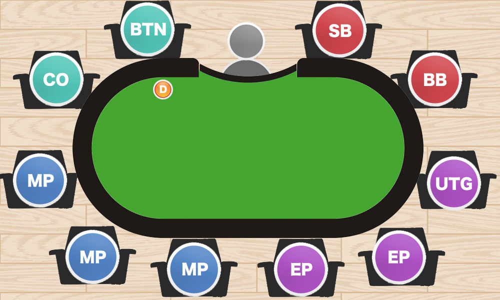
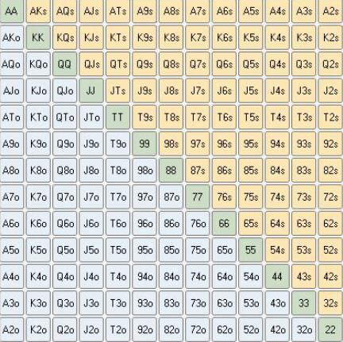
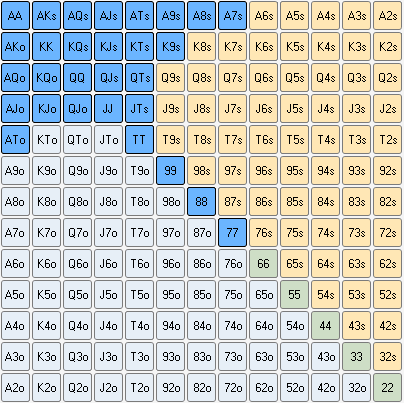
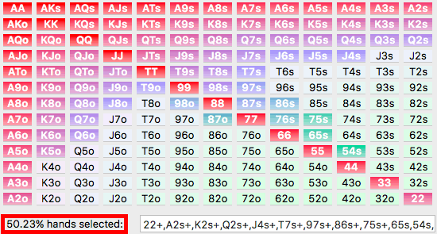

## 基本规则

1. 确定位置：首先随机确定庄家 BTN 的位置，然后从庄家开始，顺时针方向（左至右）依次为小盲位 SB、大盲位 BB、枪口位 UTG、早期位 EP、中期位 MP、关煞位 CO
2. 翻牌前（发牌）：每个玩家发到 2 张排面朝下的口袋牌，小盲注和大盲注玩家下盲注，然后从 UTG 开始依次表态（跟注、加注、过牌、弃牌）
3. 翻牌：同时发三张公牌，由小盲注开始按照顺时针方向依次表态
4. 转牌&河牌：分别发一张公牌，由小盲注开始按照顺时针方向依次表态
5. 亮牌：经过前面四轮发牌和下注，场上还剩余 2 名以上的玩家时，开始亮牌比大小

## 手牌强度

| 牌型       | 示例         | 概率    |
| ---------- | ------------ | ------- |
| 皇家同花顺 | 10♥J♥Q♥K♥A♥  | 0.0031% |
| 同花顺     | 5♦6♦7♦8♦9♦   | 0.0311% |
| 四条       | A♥A♦A♣A♠2♠   | 0.168%  |
| 葫芦       | K♥K♦K♣10♠10♣ | 2.60%   |
| 同花       | 3♠5♠6♠9♠J♠   | 3.03%   |
| 顺子       | 3♠4♥5♥6♣7♣   | 4.62%   |
| 三条       | J♠J♥J♣3♥6♣   | 4.83%   |
| 两对       | A♠A♦J♠J♥7♦   | 23.5%   |
| 一对       | 9♠9♦7♠4♥2♦   | 43.8%   |
| 高牌       | A♠2♦4♦6♣8♣   | 17.41%  |

## 下注策略

从长远来看，决定是否下注（或加注）的主要理由是：我们希望我们的下注（或加注）是有利可图的。

在德扑中，每个有利可图的下注（或加注）的理由都会是以下二者之一，为了能做出成功的下注，学会辨别是哪种原因使你作出下注（或加注）的行为是非常必要的。

### 1. 为了价值下注

1. 我认为自己有最好的牌，同时认为我的对手会拿差牌跟注。
2. 我想让对手跟注

我们从来都不会知道我们是否持有最好的牌，不过也没关系。重要的是当我们下注时，我们要有理由相信我们的牌是最好的。但判断我们是否持有最好的牌是需要技巧的，而获得这种德扑游戏技巧需要的是时间和实践。但关键之处在于，每当对手持有一手差牌下注时，我们就是在赚钱。

在一手牌中，我们的对手是否会击中听牌反超我们并不重要。重要的是在我们下注时，对手的赢率不高，而且还在底池里投入了更多的钱。

### 2. 为了诈唬下注

1. 我知道我有一手烂牌，但我认为我可以让对手弃掉一手更好的牌。
2. 我希望对手弃牌。

如果我们的对手真的弃掉了一手赢率比我们高的牌，他们就犯错了，而我们就会从他们的错误中获利。诈唬性下注比价值下注需要更多的技巧，因为很难有理由相信我们会让对手盖掉一手更好的牌。尽管如此，如果运用得当的话，这仍然是有利可图的。

但是，如果我们知道我们的下注肯定会被对手跟注（根据对手习惯或“马脚”），那我们就不应该诈唬。

### 永远要明确为什么下注

弄明白你在一手牌中的赢率是多少，你就会知道你正在做什么类型的下注。

1. 如果你认为你在一手牌中有多于 50%的赢率，你就是在为了价值而下注。
2. 如果你认为你在一手牌中有少于 50%的赢率，你就是在为了诈唬而下注。

如果在一手牌中，我们不能明确我们是在为了价值或是诈唬而下注（或加注），那在一开始就不应该去下注（或加注）。盲目地下注（或加注）是一种很差的打法，而且将会是你游戏中一个巨大的漏洞。

许多新手玩家会输钱，就是因为他们在一开始就不知道为什么要去下注（或加注）。

## 翻牌前策略

德州扑克的起手牌一共有 169 种。起手牌拿的好，获胜的可能性就会高。

很多人以为带 A 的就是好牌，实际不是！比如 A2 不同花色，获胜的概率只有 8.2%，在所有的 169 种起手牌中排名只有 117 名。至于 72 不同花色的，拿到直接就扔，因为这样的牌 25 把才能赢一次。

在实战中，大对子（JJ 以上），绝对高牌（AK, AQ），相对高的同花连牌（QJ, J10），是好牌，拿到这些牌，起手就可以多加注一些。起手牌的获胜概率如果小于 10%，建议可以放弃第一轮看牌。

从概率计算结果来看，拿到对子最好以单挑为主，如果偷偷溜进多人池胜率反而会降低很多。

### 手牌矩阵

下面的表格或者说矩阵是德州扑克中所有可能的手牌组合的直观表现。概括起来有 169 手不同的起手牌和 3 种不同的类型。（图中用灰色、绿色和棕褐色标注）

1. 第一种类型的组合是花色不同的牌（offsuit）。不同花色的手牌组合的名称旁边有一个`o`。矩阵当中用灰色标注。这种类型的手牌组合由两张花色不同的牌组成，比如 Ah5c 或者 9d7s。
2. 第二种类型的组合是对子。对子是两张等级相同的牌的组合。在矩阵中用绿色表示。例如 QcQd 或者 6d6h。对子从来都不会是相同花色的，因此 QcQc 这样的组合是不存在的。
3. 最后一种类型的组合是花色相同的牌（suited）。相同花色的手牌组合的名称旁边有一个`s`，矩阵当中用棕褐色标注。两张花色相同的牌组成同花手牌。例如 AsTs 或 9c8c。

手牌矩阵很强大。它可以让你迅速和直观的看到一个牌手的手牌范围（在某个点，一个牌手能够拥有的所有的手牌），更容易记在心中。

范围从翻牌前就存在了，你面对的是 78 种不同花色组合手牌中的 1 种，78 种相同花色手牌组合中的 1 种或是 13 种对子中的 1 种。当你决定行动的时候（下注、加注、跟注或是弃牌），你就会透露出一些关于你手牌范围的信息。

如果我们认为对手在 UTG 位置会打 14% 的牌，那他的手牌范围会是什么呢？只要简单的输入 14%进入手牌矩阵系统 Equilab 中，它就会显示出那所有 14% 的范围

思考关于范围的策略是顶级牌手处理牌局的方式之一。在思考牌手的手牌范围时，我们就应该想想所有可能的手牌组合。

## 等牌策略

有的时候，没有牌需要等牌。什么时候等，什么时候不等，也是一门学问。按照我的观点，无非就是花最小的代价等最好的牌。

等牌的时候，自己可以加最小注，这样可以稳住可能会潜在加注的玩家，花小价钱去买牌，说不定还可以吓走一些没牌的人。

**等牌的核心思想：花最小的钱，等最大的牌。**

## 8 种 Tilt 类型

Tilt（情绪失控，上头）一般来说都有发生的原因。由于人性的弱点存在，Tilt 几乎不可能不发生。第一时间发现、控制并且远离 Tilt，对于每位玩家来说都是一门必修功课。甚至有个靠打牌买了房子的德扑玩家说：

成功的牌手和失败的牌手的分界线不是技术，而是能不能正确认识和控制 Tilt。

下面是 8 种常见的 Tilt 类型，实战中要提醒自己避免陷入 tilt 当中，同时也可以通过对手的行为来分析对手可能进入了哪种类型的 tilt 当中，并制定相应的策略：

1. 下风期：因为运气不好而 Tilt 实际上并不是一种独特的 Tilt，短期内一种或多种其他类型的 Tilt 频繁发生，而在下一次游戏之前你又不能完全的调整过来，Tilt 程度越来越深，并扎根你的脑海中形成挥之不去的阴影。
2. 不公平型：Bad beat，被爆冷，被对手用弱听牌击败。被 BB 一次，没有感觉，这就是扑克，BB 第二次，开始有点感觉了，今天运气有点差。BB 第三次，开始有点上头了，你觉得自己被诅咒、觉得扑克是没有公平性可言的，然后 tilt，开始打得很激进或者做出一些不合常规的动作。
3. 怕输型：很多玩家尽管知道短期内扑克是波动性的游戏，但是他们还是很害怕输钱，渴望胜利并不是你的错，真正的问题是你如何面对德扑中的失败。
4. 权威感型：Tilt 的原因是你认为胜利是属于你的，而你眼中没有资格获胜的玩家竟然击败了你，尤其是被鱼玩家的怪异打法打败，很容易情绪上头变得非常激进。
5. 报复型：被对手的言语和挑衅戏弄等原因都有可能激怒你，让你想要在牌桌上报复对手。例如在一场线下牌局中，有个人 3bet 以后，我朋友弃牌，谁知那人甩出手上的 27o，说：看，我 27 都赢你，你还打得赢我？这个听完这句话朋友脸色都变了。Tilt 以后牌桌上变得过于激进和盯着他下注，最后可想而知结果是什么样的。
6. 状态型：也许是因为你睡眠不足，白天工作太累，或者生活/工作里的某件事情影响了你，例如女朋友正在跟你闹别扭，老板发信息通知明天要加班等等，这些负面的因素都有可能让你发挥失常。
7. 绝望型：为了赢回输掉的钱，做奋力一搏，这就会导致你玩过长的时间，过分的激进，并且还会越级去打高额桌的游戏。
8. 大意型：最后这种 Tilt 并不是因为负面因素产生，而是从发现桌上有大鱼时就产生欲望，不知不觉时已经有了情绪的波动，或者是因为打的太顺，看着别人和自己的筹码落差自信心爆棚，太过于得意导致注意力分散，没有注意到对手已经改变了打法，最终导致失败。

## 3 种比赛模式

德州扑克比赛一般分为三种，分别为：

### 现金桌 CASH

现金桌是德州扑克最常见的模式，玩法非常自由，随时参与和随时退出牌局，参赛时有金额带入限制，不能低于或高于某个范围。

### 单桌赛 SNG

单桌赛（Sit and Go，简称 SNG）通常是 6 人参与的形式，参赛者必须缴纳一定的报名费，而且参赛人数达到 6 人才能开赛，所以也可以称为“坐满即玩”。

### 多桌赛 MTT

多桌锦标赛（Multi-Table Tournament，简称 MTT）属于标准扑克锦标赛，通常我们所说的德州扑克锦标赛一般都是指 MTT，想要参与比赛的玩家通常需要缴纳一定金额的报名费，而且一般来说奖池也非常诱人和丰厚，所以参赛人数也较多。

MTT 参赛选手报名后以同样数量的筹码开始比赛，比赛是多桌同时进行，输光记分牌的选手被淘汰，直至决出最后一位冠军，获得最大的奖金。

MTT 最大的特点是比赛过程中按时间进度提高大小盲注的数量（升盲），因此玩法和策略和现金桌有很大不同。

## MTT 和 CASH 的区别

由于升盲机制的存在，MTT 的比赛节奏会快很多，CASH 的玩家习惯了在一个相对较慢的节奏中玩牌，他们可以一个晚上坐在那儿玩很少的牌做一个安静的“紧凶型”选手。然而到了比赛桌上，情况就不一样了。我们会看到许多选手在中间位置开很多牌，甚至出现很多翻前全下的行动。

### CASH 需要紧凶，MTT 需要松凶

在 CASH 中，紧凶是最佳策略，选手能做出更多+EV 的决定。

在 MTT 中，如何成为一名优秀的松凶选手以此来获得更多的优势或剥削较弱的选手成了更重要的事情。选手必须更积极的争夺底池，时刻关注自己的位置、全下的手牌范围、大小盲、前注、剩余的对手风格及你们的相对位置关系、场上选手的筹码量等等。选手需要打得更激进，积极寻找翻倍的机会。这就使得比赛看起来很疯狂，因为有时候你不得不用一些不那么好的牌去冒险，尤其是在赛事后期，有时候中间对子也需要尽可能的去做价值下注，也需要用同花连牌执行 3-bet，以及频繁的攻击盲位选手。反之，也要积极的守护自己的大盲。

### MTT 需要更有耐心

在 CASH 中，感觉状态不好或者一直不来牌可以选择离桌，或者给自己一段时间休息一下。

MTT 一旦开始，就需要选手让自己保持高度的警惕和集中，把自己的牌桌当做最后的决赛桌来对待，而这种对自己的要求会持续好几个小时。另一方面，优秀的选手会耐心的等待更好的时机进入底池。MTT 是一场长途旅行，每个人都向往终点，尤其是现场比赛通常都要花费好几天的时间，不到最后一刻都无法预知最后的冠军得主，如果没有耐心将无法走得更远。

### MTT 中抢盲更常见

Phil Gordon 曾公开承认自己在比赛中是以偷盲为生的，可见在比赛中经常抢得盲注对于选手来说是非常有价值的。抢盲很重要，对手抢盲时防守自己的盲注同样重要。这使得盲注位的范围会变宽。
在 CASH 中，大盲通常只占到有效筹码的 1%左右，然而在 MTT 中，这个比例可能会上升到 10%。

### 筹码量的影响

在 CASH 中，筹码量与其价值等同，并不会随时间而变化。

在 MTT 中，前期筹码的价值远远比不上后期。MTT 的筹码量也会决定范围和策略，例如大筹码玩家常常给中短码的玩家造成很大的压力，因为随着盲注的增长，短码玩家会逐渐缩紧自己的范围。
对待 ALL-IN 的态度

一般的 MTT 中，选手无法 Re-buy，所以赛事中一些重大的波动（全下或超池下注），将经过深思熟虑。尤其是在泡沫阶段，不要轻易跟注大筹码的超池下注，除非你的牌很强或者你的筹码同样很多。因此说对于 MTT 选手而言，一个错误可能就会导致万劫不复，选手的每一个决定都应该考虑清楚，避免用大量的筹码犯错。

## 4 种翻前风格和判断方法

德扑中常见的 4 种[翻前风格](https://zhuanlan.zhihu.com/p/103612618)：紧凶、松凶、紧弱、松弱

VPIP 和 PFR 是了解对手时必备的两个数据指标，这两个指标都是根据玩家翻前行动得出的统计数据。

1. VPIP（Voluntarily Put in Pot）：主动入池率，是指玩家主动把筹码投入底池的频率（不包括被迫投入筹码的大盲注或小盲注）。VPIP 统计所有翻前动作，包括加注、跟注、跛入。例如，如果你在 10 手牌中，翻前跛入 2 手、加注 3 手、跟注 1 手，那么你将在 10 手牌中玩 6 手，因此你的 VPIP 将为 60%。
2. PFR（Preflop Raise）：翻前加注率，是指玩家翻牌前加注的频率。该数据仅计算你在翻牌前加注入池的次数，并不包括翻牌前的跛入和跟注。例如，仍然使用上面的例子，你在 10 手牌中翻前加注了 3 手，你的 PFR 将为 30%。一名玩家的 PFR 将始终低于其 VPIP。

> 跛入：limp，跟随大盲注混入底池，而不是在别人加注的情况下跟注入池。通常情况下，跛入者的起手牌并不理想，只是希望付出最小的筹码混入底池看看翻牌圈，从而碰碰自己的运气。

1. 注意样本量：在判断对手的打法之前，拥有适当的样本量非常重要。玩家的 VPIP 可能会根据他们获得的手牌质量发生巨大变化，因此你认为是松凶疯狂型的玩家可能是拿到好牌的紧玩家。大约 300 手牌通常是足够大的样本，可以开始对对手进行可靠的解读。
2. 针对不同的游戏形式进行调整：每种玩家类型的 VPIP 和 PFR 并不是一成不变的，通常会根据所玩的德扑模式进行调整。同时，桌上的人越少，你可以预期每个人的手牌范围就越宽，因为即使是紧手的玩家也知道他们需要玩更多手牌才能跟上盲注流失。
3. 对调整持开放态度：如果你发现某人的 VPIP/PFR 在一定样本内特别明显，不要害怕做出调整。例如，如果你遇到盲注位的紧玩家，你应该用更宽的范围加注来抢走他们的盲注。同样，如果你在盲注位遇到一个紧或被动玩家的加注，你应该更频繁地弃牌，因为你知道他们的范围会比一般玩家更窄。

## 低级别 CASH 桌打牌策略

据 PTR 的数据显示，作者 BlackRain79 一直是 PS 低级别盈利最多的人之一。根据他的总结，只要能够做到以下三点，你就可以在低级别德扑中赚到比现在多几倍的钱。

**因为自己参与的绝大多数牌局都是低级别牌局，这个打牌策略对于实战很有参考价值。**

### 善用松凶打法

多数玩家在接触德州扑克时都会听到过来人劝说要打得紧打得保守些，只有在拿到非常强的牌时才去打大底池。可问题是当你决定听从这些建议时，其他人也是这么做的，在这样的游戏环境中，如果你跟别人一样做着相同的事，你不可能有出头之日，你的成绩也会和那些人一样，要么是勉强回本，要么略有盈余。

低级别游戏中最大的赢家往往是那些打得松打得凶的人，松凶策略是眼下碾压低级别最好的方式。我们都知道在游戏中拿到一手超强牌是多不容易的事，因为它们出现的频率并不高，比如 AA 这手牌，每发 220 手牌它才会出现一次，而你拿着两张同花牌在翻牌成功中花的几率也是每 118 手才会中一次，用任意两张牌看翻牌时，三次中你有两次是什么都不中的。

这意味着底池里常常会出现许多“死钱”，谁最努力去争这些钱，谁就最有机会赢走这些钱。因为从长远来说所有人拿到好牌的几率都是一样的，所以谁能在大家都不中牌时去抢下这些小底池，谁就能比别人赚得多。

这正是松凶玩法起作用的原因，那松凶玩法具体要怎么操作？

如果桌上坐满打得紧的对手，那你可以用很多牌型偷盲，尤其是你坐后位而前面的人都弃牌时，就我自己来说，当我坐按钮位，前面的玩家都弃牌，只剩大小盲两位紧人没说话，那我会用 50%的起手牌加注，范围如下图所示。

进入翻牌后我要抓住一切可以下注的机会，尤其是在单挑底池中，但不用下注太多，多数时候下半个底池就够了。持续下注施压的话，这是在逼紧弱型玩家只能用一手不错的牌才能继续，但我都知道他们多数时候都是拿不到不错的牌的。

激进的打法在偏紧的低级别游戏中是很奏效的，但有一点大家要记住，一旦对手反击，你一定要尊重他们的出手，因为打得紧的人很少会乱来。

走松凶路线最后一个关键要素是一定要保证自己诈唬的频率是足够多的，这么做的原因还是开头的那个理由：对手中牌概率低。

提高诈唬率的一个方式是利用惊悚牌来达到诈唬成功的目的。惊悚牌就是那些会让对手忌惮的牌，一般是 A 或 K 这种人头牌，同时也可以是转牌或河牌圈那些促成了同花或顺子的牌。

举个例子：你用 55 在翻牌加注，盲注位一个紧人跟注，翻牌 2-6-10，对手过牌，你做了一个标准的 c-bet（continuous bet，连续加注）。转牌 K，对手过牌，这张 K 就是一张惊悚牌，你选择继续下注，对手还是跟注。河牌 A，对手第三次过牌，这张牌也是会让对手忌惮的牌。你想象一下如果对手在翻牌是用顶对跟注到现在，那这个牌面对这位紧人而言是很吓人的，你在这时候开第三枪能拿下底池的几率很大。多数盈利型玩家就是这么做的，他们会在不摊牌的情况下赢走更多底池。

### 主要跟鱼打

做了 14 年职业牌手，这 14 年来我一直能够赚到钱的一个很重要原因是：我从不逞强，我只挑容易打的牌桌落座，只赚容易挣的钱。

作为一名职牌，我上桌的目标很明确：赚钱养活自己。

达到这个目的最容易的一个办法就是专挑鱼多的牌桌玩，只跟水平低的对手打牌，因此我在挑桌方面很用心，在刚入行的时候，我只在那些玩家水平普遍比较低的网站打牌，然后每次在挑桌的时候，这张牌桌至少要有一条鱼我才会留下来玩，所谓鱼指的就是那些 VPIP（主动入池率）≥40%的玩家，如果他们离开，那我就会跟着离桌。

当然，如果你是一个独孤求败式的玩家，只想跟高手过招，不在乎亏损，那你尽可到难打的牌桌去玩，可如果你打牌是为了养家糊口，那我劝你还是现实一些，不要那么懒，多做一些调查，看看自己能玩的那些线上扑克室，哪些扑克室的鱼比较多，哪个时段的鱼比较多，哪个级别的牌桌比较容易挣钱。

不要只是盲目的随便挑一张牌桌坐下，然后就不管不顾地玩起来，在我多年的打牌经历里，我很清楚如果自己想要一直保持盈利，如何挑选容易打的牌桌也是必修课之一。

### 防止 Tilt

很多人不盈利的罪魁祸首就是自己把自己搞残的，意思是他们因为上头而输掉大部分钱或大部分已经赢来的钱。

打牌之所以能赢钱的一个主要原因就是它依赖极强的心理素质，由于短期来说什么事都可能发生，这种短期的结果甚至会令技术很强的玩家失去理智进而犯下大错。

德州扑克真的宛如一座巨大的过山车。游戏里是数不清的起起伏伏，而最大的赢家往往是那些从长远来说经历起多于伏的人。

这就是为什么我说 Tilt 是你在牌桌的头号敌人，过去是，现在是，将来还是。

如果你能够像我上述所说的一直用正确的方式游戏并且只跟鱼玩家交手，到头来还输的话那就是你自己的问题了。

有时候不管你在牌桌上多自律技术发挥得多好，一天的工作结束后你依旧会是颗粒无收。你之前可能遇过这种情况，就是每次终于拿到一手牌了，却最终输给了更强的牌，不管你怎么努力都还是赢不了。对于多数玩家而言，这种时刻就会让他们很上头，进而开始打得毫无章法，开始做一些如果是平常时候根本不会做的错误决定。

大家不要做这种人，应该学会接受这种时不时的无奈，在经历这种时刻时最好的办法不是正面迎敌，而是躲开它，如果你能够做到如此自律，你已经赢过低级别游戏中 95%的玩家了。

打了十多年牌，玩了成千上万手牌之后，这些经历教会了我：即便你在牌桌所做的每一个决定都是对的，你还是有可能会碰上一连几天、几个星期甚至是几个月的下风期，这种时刻出现的次数多到能让人怀疑人生。曾经有过好几次的下风期，我需要把自己曾经打出的成绩打印出来贴到墙上或是用它们当做桌面，用这些成绩提醒自己我还是一个盈利型玩家，只有这么做才不至于让自己失去打牌的信心。

而这么多年的牌桌经历给我带来的积淀是，在面对这些波动时，我已经能够用更理智的心态去面对这种起伏，也不再像以前那样，在牌桌做了正确的决定后，当碰上 BB 时会暴跳如雷或失去理智，这么多年的经历告诉我波动是免不了的，当下风期出现的时候，我们能做的只有继续在牌桌发挥自己最好的水平，用正确的打法玩牌，用一个良好的心态去面对这种“诸事不顺”的时刻。

当然，我们终究只是凡人，遇到这种时刻肯定会有些上头，而多数人是没法控制自己情绪的，所以一旦你发现自己有上头的迹象，比如开始频繁入局，开始做一些很不理智的跟注，那最好的做法就是立马起身离开。

当感觉快要失控时，那就立即离开牌桌，不要因为一时的爆冷或 cooler 就让之前努力赢来的钱付诸东流。
