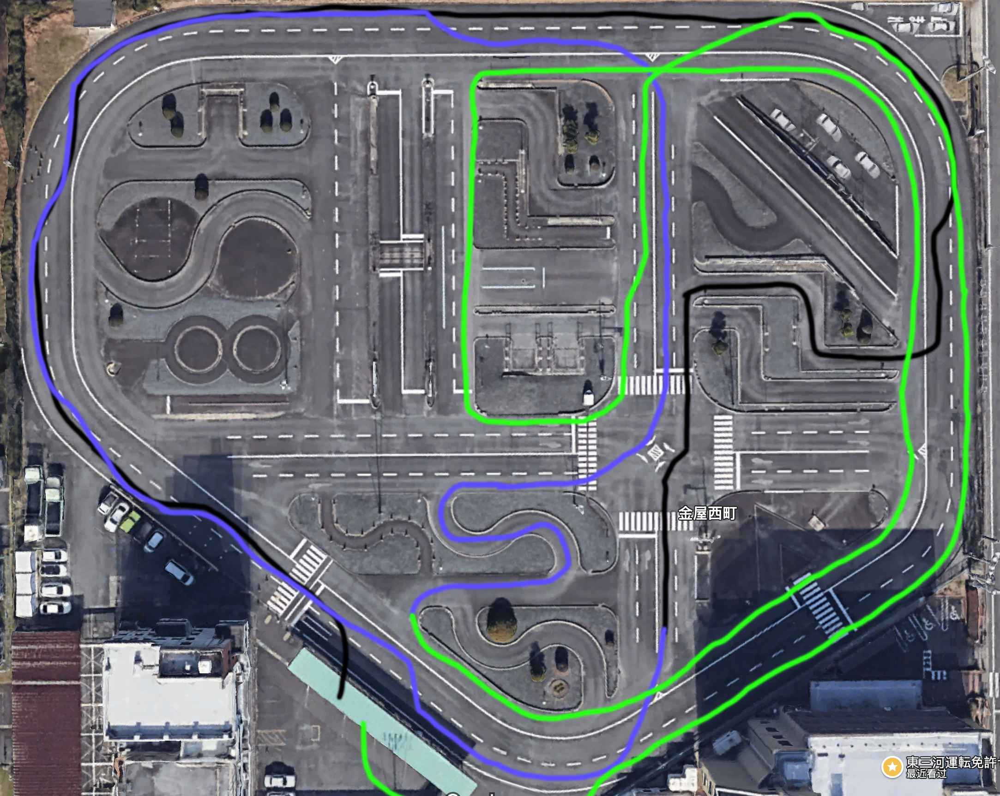
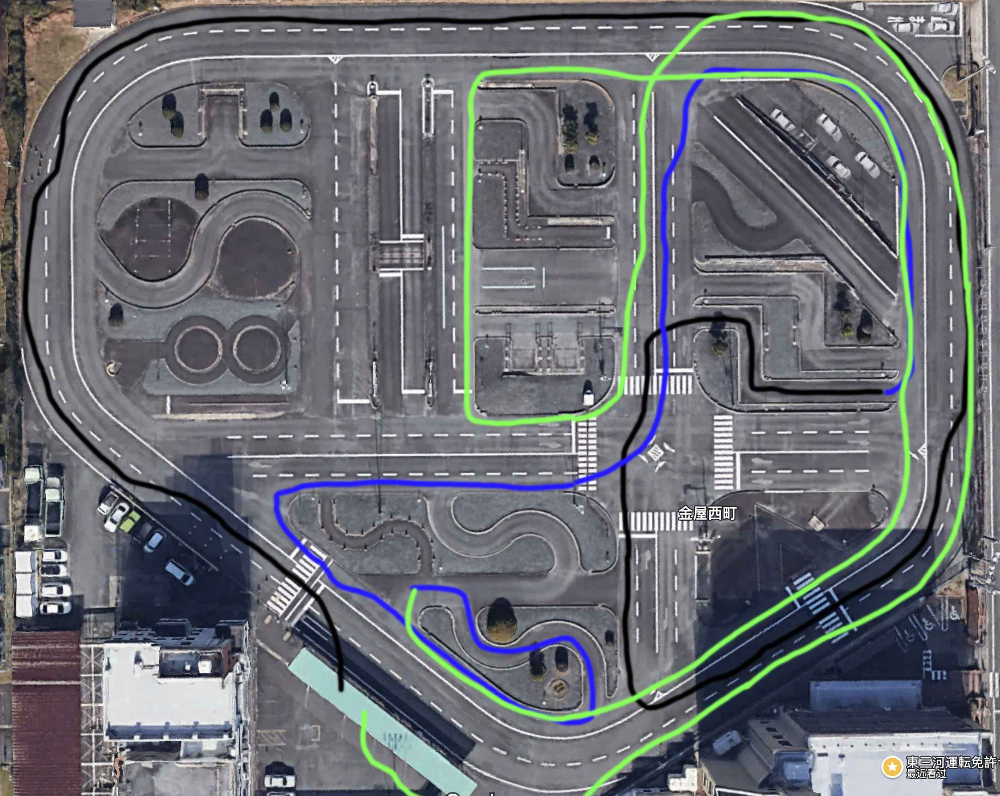

## 東三河免許切り替え試験準備

### A course

### B course

### 以前的经验总结

#### 如何判断“左寄せ”的距离

当道路左侧的白线在车头正中央时，差不多车辆靠左的距离就可以了!!!

#### 开车要学会预判，留好提前量

1. 开车多看远方，多提前预判，不要等到了再确认，这样就来不及了，而且也会慌张和停顿
2. 打灯一定要提前打，越早打效果越好，不要到了再打。
3. 过障碍物的时候也是要提前避开，不要等到了跟前再打方向

#### 安全确认

1. 变道前打转向灯，数 3 秒，按上侧后的顺序安全确认，然后换道
2. 右转弯的时候右方来车，左方来车， 右方来车
3. 停车后左转弯要确认右方来车，左方来车，左后方是否有自行车，右方来车
4. 行驶中左转弯提前打灯确认左后方没自行车后提前向左靠，最好的状态是转弯过来直接向左靠好，不用再去修方向盘
5. 人行横道通过前要左右确认是否有行人

不要只记住左右左确认，而是要思考这么做是为了什么，和实际情况有什么联系，这样拿到驾照后实际上路也不害怕

#### 过弯

1. 过弯之前要减速充分，用油门保持速度
2. 过弯的过程中脚离开刹车，一定不要踩刹车!!!
3. 就像玩赛车游戏一样，进弯之前要减速，过弯的时候不要踩刹车，不然打方向的时候很容易车辆失去控制，出弯的时候加速
